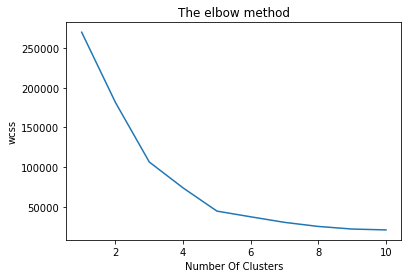
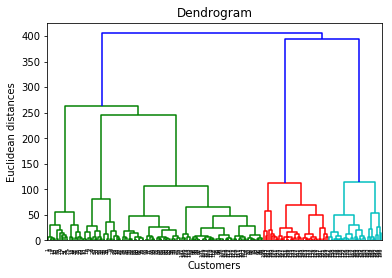
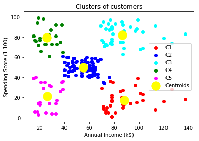
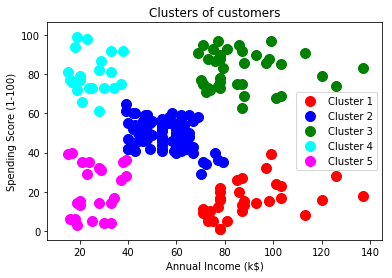

# Categorize-Clustering-Mall-Customer
Clustering Mall Customer into groups depends on anual incom and spending score using K-Means algorithm

<h2>Choose number of clusters using elbow method</h2>

<h2>Choose number of clusters using dendrogram method</h2>

 <h2>Clustering</h2>
 
  
 
